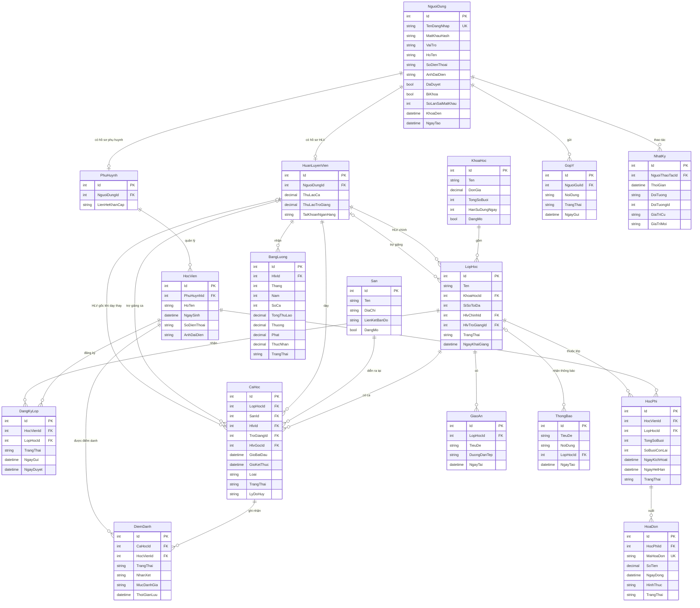

```mermaid
erDiagram
    NguoiDung ||--o| HuanLuyenVien : "có hồ sơ HLV"
    NguoiDung ||--o| PhuHuynh : "có hồ sơ phụ huynh"
    PhuHuynh ||--o{ HocVien : "quản lý"
    KhoaHoc ||--o{ LopHoc : "gồm"
    HuanLuyenVien ||--o{ LopHoc : "HLV chính"
    HuanLuyenVien |o--o{ LopHoc : "trợ giảng"
    HocVien ||--o{ DangKyLop : "đăng ký"
    LopHoc ||--o{ DangKyLop : "nhận"
    LopHoc ||--o{ CaHoc : "có ca"
    San ||--o{ CaHoc : "diễn ra tại"
    HuanLuyenVien ||--o{ CaHoc : "dạy"
    HuanLuyenVien |o--o{ CaHoc : "trợ giảng ca"
    HuanLuyenVien |o--o{ CaHoc : "HLV gốc khi dạy thay"
    CaHoc ||--o{ DiemDanh : "ghi nhận"
    HocVien ||--o{ DiemDanh : "được điểm danh"
    HocVien ||--o{ HocPhi : "đóng"
    LopHoc ||--o{ HocPhi : "thuộc lớp"
    HocPhi ||--o{ HoaDon : "xuất"
    HuanLuyenVien ||--o{ BangLuong : "nhận"
    LopHoc ||--o{ GiaoAn : "có"
    LopHoc |o--o{ ThongBao : "nhận thông báo"
    NguoiDung ||--o{ GopY : "gửi"
    NguoiDung ||--o{ NhatKy : "thao tác"

    NguoiDung {
        int Id PK
        string TenDangNhap UK
        string MatKhauHash
        string VaiTro
        string HoTen
        string SoDienThoai
        string AnhDaiDien
        bool DaDuyet
        bool BiKhoa
        int SoLanSaiMatKhau
        datetime KhoaDen
        datetime NgayTao
    }
    HuanLuyenVien {
        int Id PK
        int NguoiDungId FK
        decimal ThuLaoCa
        decimal ThuLaoTroGiang
        string TaiKhoanNganHang
    }
    PhuHuynh {
        int Id PK
        int NguoiDungId FK
        string LienHeKhanCap
    }
    HocVien {
        int Id PK
        int PhuHuynhId FK
        string HoTen
        datetime NgaySinh
        string SoDienThoai
        string AnhDaiDien
    }
    KhoaHoc {
        int Id PK
        string Ten
        decimal DonGia
        int TongSoBuoi
        int HanSuDungNgay
        bool DangMo
    }
    San {
        int Id PK
        string Ten
        string DiaChi
        string LienKetBanDo
        bool DangMo
    }
    LopHoc {
        int Id PK
        string Ten
        int KhoaHocId FK
        int SiSoToiDa
        int HlvChinhId FK
        int HlvTroGiangId FK
        string TrangThai
        datetime NgayKhaiGiang
    }
    DangKyLop {
        int Id PK
        int HocVienId FK
        int LopHocId FK
        string TrangThai
        datetime NgayGui
        datetime NgayDuyet
    }
    CaHoc {
        int Id PK
        int LopHocId FK
        int SanId FK
        int HlvId FK
        int TroGiangId FK
        int HlvGocId FK
        datetime GioBatDau
        datetime GioKetThuc
        string Loai
        string TrangThai
        string LyDoHuy
    }
    DiemDanh {
        int Id PK
        int CaHocId FK
        int HocVienId FK
        string TrangThai
        string NhanXet
        string MucDanhGia
        datetime ThoiGianLuu
    }
    HocPhi {
        int Id PK
        int HocVienId FK
        int LopHocId FK
        int TongSoBuoi
        int SoBuoiConLai
        datetime NgayKichHoat
        datetime NgayHetHan
        string TrangThai
    }
    HoaDon {
        int Id PK
        int HocPhiId FK
        string MaHoaDon UK
        decimal SoTien
        datetime NgayDong
        string HinhThuc
        string TrangThai
    }
    BangLuong {
        int Id PK
        int HlvId FK
        int Thang
        int Nam
        int SoCa
        decimal TongThuLao
        decimal Thuong
        decimal Phat
        decimal ThucNhan
        string TrangThai
    }
    GiaoAn {
        int Id PK
        int LopHocId FK
        string TieuDe
        string DuongDanTep
        datetime NgayTai
    }
    ThongBao {
        int Id PK
        string TieuDe
        string NoiDung
        int LopHocId FK
        datetime NgayTao
    }
    GopY {
        int Id PK
        int NguoiGuiId FK
        string NoiDung
        string TrangThai
        datetime NgayGui
    }
    NhatKy {
        int Id PK
        int NguoiThaoTacId FK
        datetime ThoiGian
        string DoiTuong
        int DoiTuongId
        string GiaTriCu
        string GiaTriMoi
    }
```
